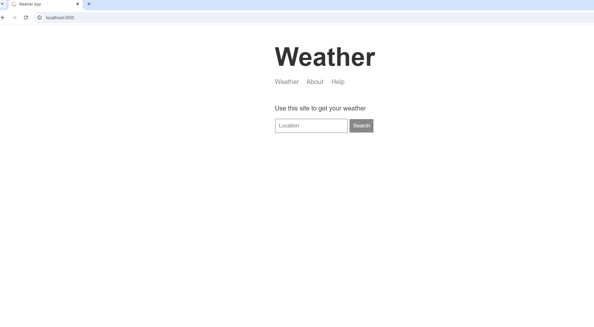

# 🌦️ Weather App

A simple Node.js and Express-based Weather App that allows users to search for any location and receive real-time weather data.

## 🔧 Tech Stack
- Node.js
- Express.js
- Handlebars (HBS)
- Mapbox API
- Weatherstack API

## 🚀 Run Locally

```bash
git clone https://github.com/Earlvyn-24/weather-app.git
cd weather-app
npm install
npm run dev

